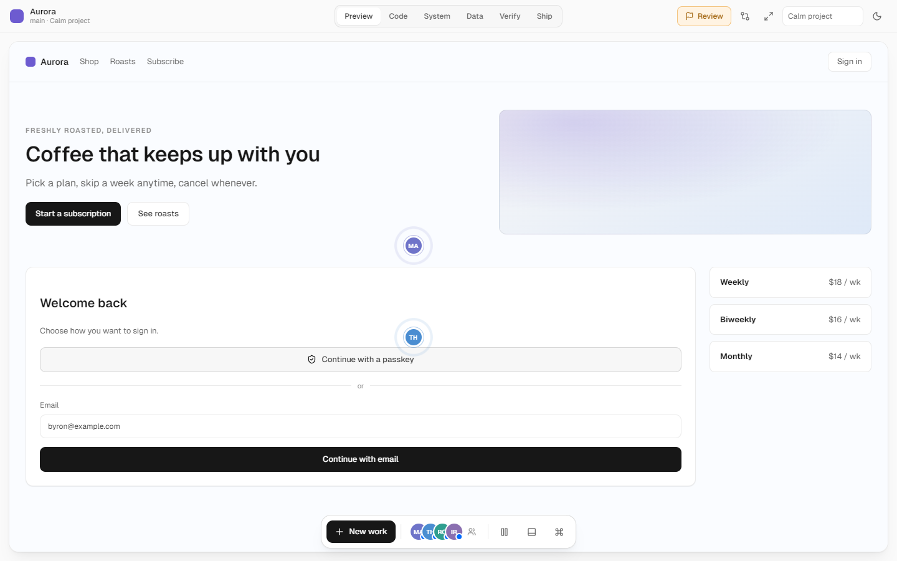
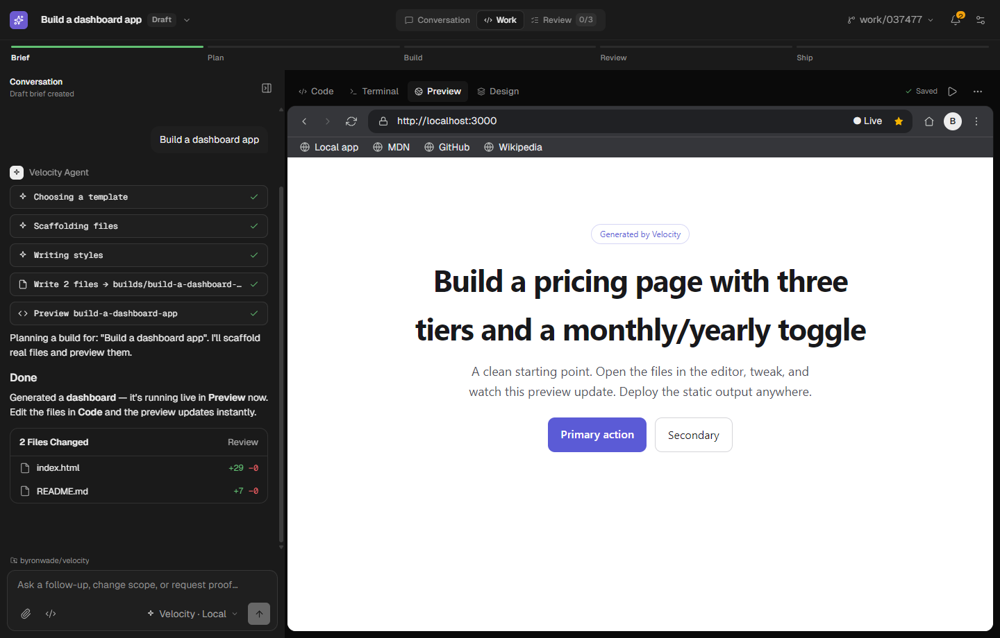
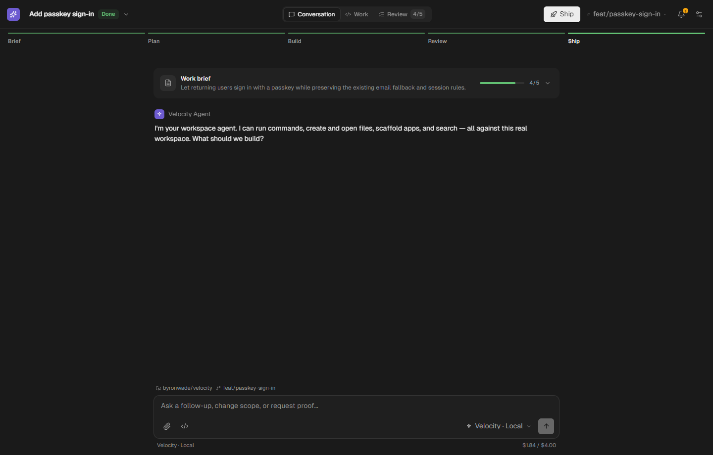

# Velocity

Velocity is an open-source, local-first **autonomous software-development workspace**. Named AI
coworkers continuously build a shared project while you direct, observe, and approve — it is not a
chat app. The full product thesis lives in [`VELOCITY_PRODUCT_VISION.md`](VELOCITY_PRODUCT_VISION.md).



## The prototype (Phase 1)

A polished, deterministic, design-first prototype of the workspace lives in
[`src/velocity/`](src/velocity/). It renders as the default app. Nothing there talks to a provider
or the network — a `CoworkerRuntime` produces every state transition deterministically, so the
demo is fully repeatable.

- **Project tabs** — the top row is a tab per project; each tab is a fully isolated workspace
  (its own coworkers, missions, lens, open terminals/tools, and rails). Above the tabs sits the
  account bar — credits/usage meter, the light/dark toggle, and the user profile.
- **Quiet top bar** — project + mission progress, compare, focus, and a demo-scenario picker.
- **Split-pane workspace (Cursor-style)** — the app is the left pane; the right holds tools. Every
  pane has its own compact toolbar with a **view dropdown** (Preview · IDE · Browser · System ·
  Data · Tests · Verify) and **split-right / split-down / close** — build 50/50, stacked, or 2×2
  layouts, with draggable dividers. Toolbars adapt to pane width. A **Preview** pane also has a
  **compare selector** (vs Stable / Live / Preview / Branch) that splits it into a side-by-side.
  **Spatial presence markers** show where each coworker is working; click one to Follow.
- **Ship** is a header button that opens the deploy sheet (Vercel / Netlify / Cloudflare).
- **Floating dock** — new work, the coworker avatar stack, global pause, developer tools, ⌘K.
- **Mission Sheet** — a structured outcome + acceptance-criteria intake (no chat composer).
- **Coworkers** — add / rename / pause / dismiss / restore / follow; name and role read louder than
  the model; a manager (Maya) with two reporting specialists.
- **Collaboration** — calm Figma-style presence flags for coworkers, live cursors for human
  teammates, a **Share** dialog to invite real people (email + role), and **comments** you pin to
  the stage and hand to a coworker to fix (comment mode in the dock → click the stage).
- **Checkpoints, Evidence, and Decision Sheets** — review work with diffs, tests, traces, blast
  radius, and rollback; resolve conflicts and protected actions with a recommended option.
- **Follow Mode** — following a coworker opens a panel showing what they're doing now, their latest
  checkpoint, and their activity history. Presence flags collapse to avatars and expand on
  hover/follow, so the stage stays calm with many coworkers.
- **Ship** — deploy to **Vercel, Netlify, or Cloudflare** (deploying → live with a production URL).
- Panels **pop up from the floating dock** (no side rail); **Stable vs Candidate** compare, a
  resizable tool drawer, light + dark themes, and a command palette where every entry drives state.

Run it, then switch scenarios from the top-bar picker or the URL:

```
npm install
npm run dev            # http://localhost:5199

# seeded scenarios
/?scenario=calm        # a healthy project mid-flight (default)
/?scenario=checkpoint  # a checkpoint ready for review
/?scenario=conflict    # two coworkers conflict → a Decision Sheet
/?scenario=approval    # a protected migration needs sign-off
/?scenario=compare     # Stable vs Candidate, side by side
/?scenario=shipping    # ready to ship
/?scenario=devtools    # the Code lens + terminal drawer
/?scenario=empty        # a blank project → create a mission
# also: parallel, verifyFail   ·   append &theme=dark for dark mode
```

Keyboard: `1`–`6` switch lenses, `c` compare, `f` focus, `.` pause all, `⌘K` commands,
`⌘⇧N` new mission, `Esc` closes the topmost surface.

<details>
<summary>The earlier workstream environment</summary>

Before the autonomous-workspace redesign, Velocity was a single-workstream environment (a feature's
conversation beside its editor, terminal, browser, and design canvas). That shell still lives in
`src/workbench/` and the services it uses remain the real substrate the prototype's Code lens and
tool drawer render.



</details>

## Product model

Every workstream has three views over the same context:

- **Conversation** — the outcome, work brief, agent thread, project scope, and a persistent composer.
- **Work** — the conversation beside the tool the work needs. Four surfaces are always present —
  the CodeMirror editor (with a file tree), terminal, live browser, and design canvas. Specialized
  studios (database, API runner, tests, deployments, builder, observability, …) appear **on demand**
  as dismissible tabs, summoned from the command palette instead of cluttering the shell. Changing
  tools does not create a new project context.
- **Review** — definition-of-done criteria beside behavior or diff evidence, with explicit accept
  and send-back decisions.

An attention inbox contains only blockers, requested decisions, and review-ready work. Activity,
branch, worktree, budget, model, and evidence are progressive details instead of permanent chrome.



## Current prototype

This phase focuses on making the desktop product flow tangible before building orchestration and
persistence behind it.

Implemented now:

- A single top header: a workstream switcher (search, grouped list, new-work, account) in a
  dropdown, the Conversation/Work/Review tabs, and an attention inbox — no sidebar or icon rail.
- Conversation, Work, and Review layouts with a shared active workstream, filling the full canvas.
- The full original toolset embedded in the new shell: editor, terminal, browser preview, design
  canvas, and nine specialized studios — with the file tree, command palette, quick-open, and the
  VS Code-style keyboard shortcut system all intact.
- On-demand tools: the four core surfaces are always present; the other studios surface only when
  summoned from the palette (⌘K → "Open …"), keeping the Work view focused.
- Interactive criteria selection, behavior/diff switching, activity details, accept/send-back
  transitions, light/dark appearance, and model settings.
- A real Ollama model picker and streaming agent transport.
- A Tauri 2 desktop scaffold with local Ollama access restricted to port `11434`.

Prototype seams that are intentionally still local or seeded:

- Workstream metadata, criteria, evidence, and activity examples are in-memory design fixtures.
- New workstreams live for the current app session; durable project/worktree orchestration comes
  next.
- The browser build's filesystem and shell remain the existing in-memory implementations.

## Ollama

Start Ollama normally:

```bash
ollama serve
```

Open **Settings → Ollama**, test `http://localhost:11434`, and choose an installed model. In the
Tauri app, requests use the native HTTP plugin, so Ollama does not need a permissive browser CORS
setting. The desktop capability allowlist accepts only:

- `http://localhost:11434/*`
- `http://127.0.0.1:11434/*`

When using the Vite browser preview instead of Tauri, allow only that development origin:

```bash
OLLAMA_ORIGINS='http://localhost:5199' ollama serve
```

## Architecture

- **React 18 + TypeScript + Vite** for the workbench UI.
- **Tauri 2** for the desktop shell and native local HTTP transport.
- **Zustand** for existing editor and shell state.
- A service container in `src/services/container.tsx` for filesystem, editor, terminal, browser,
  agent, graph, preview, and design services.
- The product shell in `src/workbench/VelocityWorkbench.tsx`, with its workstream model in
  `src/workbench/model.ts` and the Code-surface file tree in `src/workbench/WorkFiles.tsx`. Every
  surface (the four core tabs and the nine studios) is the existing `src/modes/*` component, mounted
  per-workstream through a `SURFACES` registry; a studio is surfaced by dispatching a
  `velocity:open-tool` event — from a ⌘K command today, and from the agent later.
- The reusable services and tools underneath (editor, terminal, browser, design, graph, keybindings,
  live preview) are documented in [`CLAUDE.md`](CLAUDE.md).
- Desktop configuration and capabilities in `src-tauri/`.

## Develop

```bash
npm install
npm run dev             # browser preview at http://localhost:5199
npm run typecheck       # TypeScript validation
npm run build           # production web assets
npm run desktop:dev     # Tauri development app
npm run desktop:build   # native desktop bundle
```

Tauri development and builds require the Rust toolchain and the platform prerequisites documented
by Tauri. `?theme=light` and `?theme=dark` can force a theme for browser previews.
