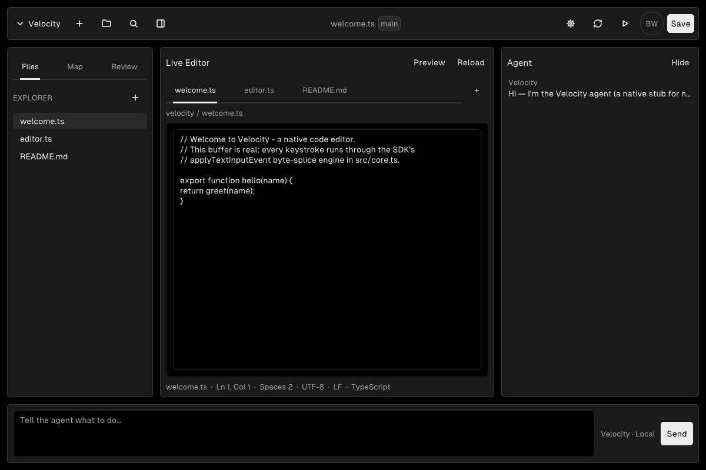

# Velocity

A fast, tiny, **native** AI code editor — being rebuilt on the
[Vercel Native SDK](https://github.com/vercel-labs/native). The desktop app is a real
single-binary native application (no browser, no DOM, no React in the binary): the UI is
declarative Native markup, the logic is a TypeScript app-core compiled ahead-of-time to
native code, and the SDK's own engine draws every pixel.



> Migrating from the original React + Vite web app (preserved as `apps/web`) to a native
> desktop monorepo. Status and design: [`docs/superpowers/specs/2026-07-13-native-sdk-migration-design.md`](docs/superpowers/specs/2026-07-13-native-sdk-migration-design.md).

## Monorepo layout

```
apps/
  desktop/    # the native app — Native SDK ts-core (app.zon + src/core.ts + src/app.native)
  web/        # the original React + Vite app, preserved as the parity reference
  site/       # marketing site (Next.js) — planned
packages/
  ui-native/  # shared native UI — currently folded into apps/desktop (see the spec)
```

Tooling: **pnpm workspaces + Turborepo**.

## The desktop app

`apps/desktop` is a native-rendered Native SDK app following the Elm/TEA shape:

- **`src/core.ts`** — `Model`, a `Msg` discriminated union, and one exhaustive `update()`,
  written in the app-core TypeScript subset and compiled to native code at build time (no JS
  runtime ships in the binary).
- **`src/app.native`** — the declarative markup view, bound to the model by field name.
- **`app.zon`** — app identity, window, platforms, capabilities.

Today it is a working workbench: a file explorer, a tab strip, a live code buffer (real text
editing through the SDK's `applyTextInputEvent`), an agent/chat pane, and a Cursor-style
Settings screen — all driven by `Model`/`update`.

### Develop

```bash
# Toolchain (once): the CLI, plus Zig 0.16.0 for native builds
npm install -g @native-sdk/cli
#   Windows: winget install zig.zig --version 0.16.0
#   macOS:   brew install zig            # (0.16.x)
#   Linux:   see https://ziglang.org/download/  (0.16.0) + libgtk-4-dev

cd apps/desktop
native check --strict     # validate core + markup + app.zon (no Zig needed)
native dev                # build a debug binary and run it (markup hot reload)
native build              # ReleaseFast binary → zig-out/bin/
native package --target macos|windows|linux --output dist
```

The `native` CLI is authoritative for this pre-1.0 SDK; run `native skills get core` /
`native skills get ts-core` / `native skills get native-ui` for the current reference.

### The original web app

```bash
pnpm install
pnpm --filter web dev     # http://localhost:5199
pnpm --filter web build
```

## CI

- **`.github/workflows/check.yml`** — `native check --strict` on every PR/push (fast, no Zig).
- **`.github/workflows/release.yml`** — matrix builds and packages the desktop app for macOS,
  Windows, and Linux, uploads each as an artifact (attached to the GitHub Release on `v*`
  tags), and runs a headless Linux Xvfb smoke test.

## Status

The migration is feature-complete: monorepo skeleton, native desktop scaffold, UI primitives,
Settings screen, native editor (code buffer + file explorer + tabs), agent pane, real
filesystem persistence via SDK `Cmd`/`Sub` effects (Save/Reload), cross-platform CI, and the
marketing site. The original React app is preserved as `apps/web`. See the
[migration spec](docs/superpowers/specs/2026-07-13-native-sdk-migration-design.md) for the
full staged history.
