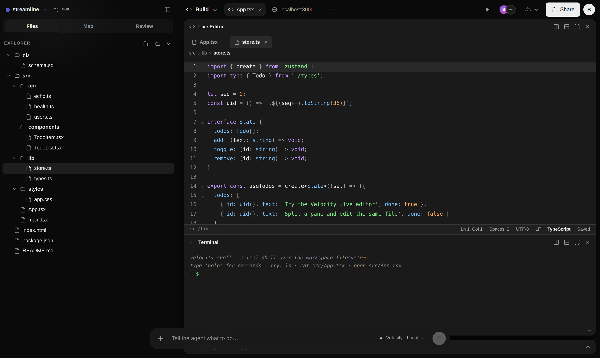
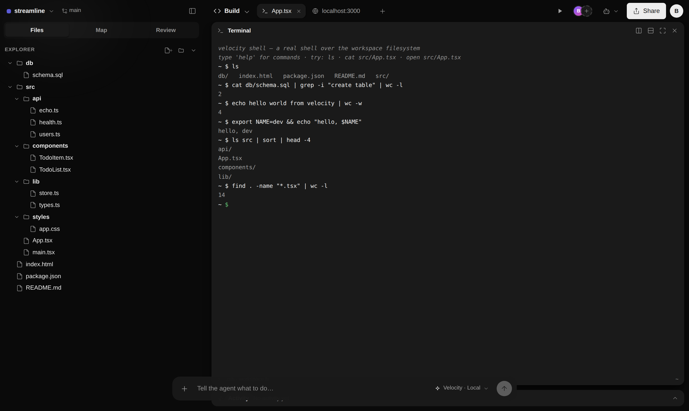
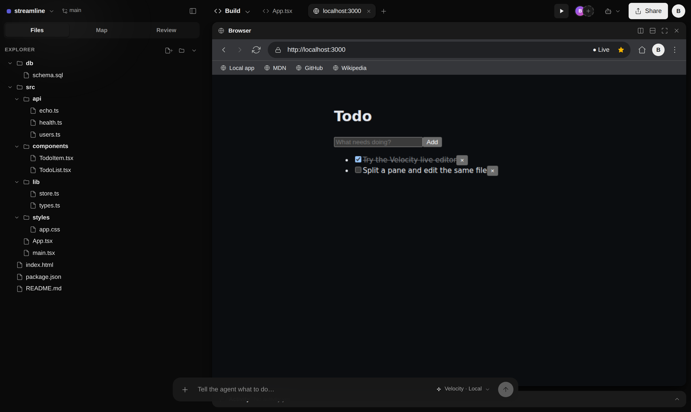
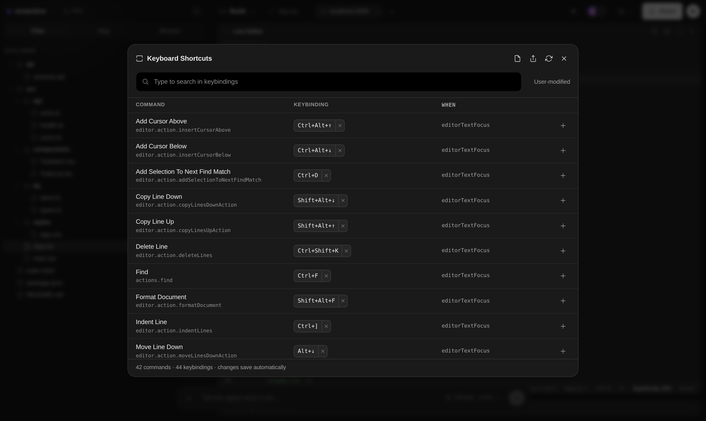
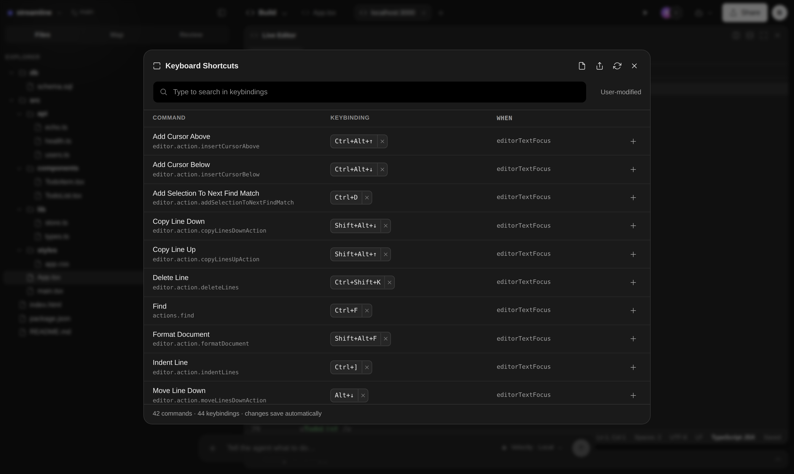
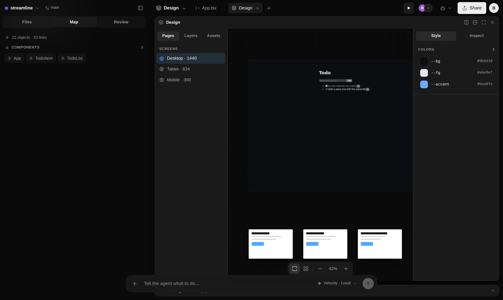

# Velocity

**A browser-native, agent-native workspace** — a code editor, a real terminal, an embedded
browser with live preview, an AI agent command bar, and a Framer-style design canvas, all in one
tab. Everything runs client-side: no backend, no language server, no container. One workspace with
many **views over a shared project graph**.



---

## Highlights

- **Real editor** — CodeMirror 6 with multi-file tabs, breadcrumbs, a status bar, find/replace,
  go-to-line, multi-cursor, rainbow bracket colorization, inline color swatches, Prettier
  formatting, and live editor settings.
- **Real terminal** — a genuine shell over the in-memory filesystem: pipes, redirection, command
  chaining, environment variables, globbing, and stdin-aware filters.
- **Real browser** — an embedded, Chrome-style browser with navigation, bookmarks, zoom, keyboard
  shortcuts, and a **live preview that runs the actual workspace app**.
- **Agent command bar** — a floating command surface backed by pluggable models (a built-in local
  agent and **Ollama** for local LLMs), with a shared tool registry, memory, project indexing, and
  automatic context compaction.
- **VS Code-style keybindings** — a full command registry and keybinding engine: chord sequences
  (`⌘K ⌘S`), `when`-clause contexts, and a searchable Keyboard Shortcuts editor where every command
  is rebindable, with import/export.
- **Design canvas, studios & a living map** — a Framer-style artboard canvas over the live app,
  studios for Data/API/Deploy/Observability/Test, and an architecture map built from a shared
  project graph derived by static analysis of the real workspace.

Everything is **real** — derived from the actual in-memory filesystem, not mock data — and every
feature has been exercised end-to-end in a headless browser.

---

## The editor

Multi-file tabs, breadcrumbs, and a status bar; syntax highlighting and rainbow brackets; ⌘P quick
open, ⌘E recent files, ⇧⌥F format (Prettier, lazy-loaded), ⌘D multi-cursor, ⌘/ comment, and a
live-applied settings panel (font size, tab width, word wrap, format-on-save).

## The terminal

Not a command lookup table — a real shell over the workspace filesystem.



- **Pipes** `a | b | c` with stdin-aware filters (`grep`, `wc`, `head`, `tail`, `sort`, `uniq`, `cat`)
- **Redirection** `> file` and `>> file` for any command
- **Chaining** `&&`, `||`, `;` with real exit-code semantics
- **Environment** `export FOO=bar`, `$FOO` / `${FOO}` expansion, `env`
- **Globbing** `ls *.tsx`, `wc -l src/*.ts`
- Quote-aware parsing, Tab completion, ↑/↓ history, Ctrl+L clear, Ctrl+C cancel

## The browser

An embedded browser tab that behaves like the real thing — and renders the live workspace app when
you visit `localhost`.



- Back / forward / reload, an address bar (search **or** URL), and a bookmarks bar
- Keyboard: ⌘L focus address, ⌘R / F5 reload, Alt+←/→ navigate, ⌘+/−/0 zoom
- A live-preview pipeline that transpiles the workspace TSX in-browser and runs it in a sandboxed
  iframe — the **Run** button opens it instantly

## Command palette & keybindings

One palette (⌘⇧P) over files, commands, studios, and the agent — each command shows its keybinding.



The Keyboard Shortcuts editor (⌘K ⌘S) mirrors VS Code: search every command, rebind with a chord
recorder, remove, reset, and import/export a `keybindings.json`.



## Design canvas

A Framer-style, pannable/zoomable canvas of artboards rendering the live app at each breakpoint,
with Pages/Layers/Assets navigation and live-editable design tokens.



---

## Architecture

- **React 18 + TypeScript + Vite**, state in **zustand** with selective subscriptions; layout,
  theme, and edits persist to `localStorage`.
- **Service DI container** (`services/container.tsx`) vends the filesystem, editor, shell, browser,
  agent, graph, preview, and design services behind stable interfaces.
- **Recursive split-pane workspace** — any pane splits horizontally/vertically and hosts any mode.
- **In-browser TSX runtime** — [sucrase](https://github.com/alangpierce/sucrase) transpiles the
  workspace's real TS/TSX and runs it against a vendored React in a sandboxed iframe, so the live
  preview and design artboards show the actual app (CSP-safe, no CDN).
- **Keybinding engine** (`keybindings/`) — command registry, physical-key matcher, `when`-clause
  evaluator, and a user-override layer, modeled on VS Code.
- **Shared project graph** (`lib/graph.ts`, `services/graph.ts`) — typed nodes and edges derived
  from static analysis of the filesystem; the map, palette, and design canvas are all views over it.

## Develop

```bash
npm install
npm run dev        # http://localhost:5199
npm run build      # production build
npm run typecheck  # tsc --noEmit
npm run preview    # serve the production build
```

`?theme=light` / `?theme=dark` forces a theme (handy for shareable links / previews).

## Status

The editor, terminal, browser, agent command bar, design canvas, studios, command palette, and
keybinding system are all implemented and working against the real workspace. Local model support
runs through Ollama (`OLLAMA_ORIGINS='*' ollama serve`). Real-time collaboration and
deploy-to-provider are present as seams with clearly-marked stubs — the next milestones on the
roadmap.
