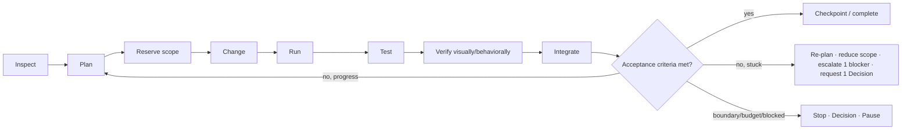

# Velocity — Product Vision (Source of Truth)

## 1. Document Status and Purpose

**Status:** Authoritative product contract. Version 1.0 (2026-07-14).
**Scope:** Documentation only. No application code, styles, tests, config, dependencies, or assets are changed by this document.
**Audience:** Claude, Codex, other agents, designers, and engineers building the next phase.

This file is the single permanent product contract for Velocity. Any future agent must be able to read this file alone — without this prompt, prior chats, or tribal knowledge — and (a) understand what Velocity is, (b) understand why the current shell does not yet express it, (c) redesign the visual and interaction model without reverting to chat-first conventions, (d) know what must be real in the prototype versus deterministically simulated versus deferred, and (e) evaluate the result against concrete flows, states, and acceptance criteria.

Two realities are documented side by side throughout:

- **[NOW]** — the observed current state of the repository (grounded in inspected files).
- **[TARGET]** — the intended future product decision.

Where they differ, that is the redesign mandate, not an accident to preserve.

Conventions: **[NOW]** = current reality. **[TARGET]** = the decision. **[P1]** = build in the Phase-1 prototype. **[P2]** = deferred to Phase-2 real logic. Decisions are stated as decisions, not options.

---

## 2. Executive Summary

Velocity is an **autonomous software-development workspace**: a desktop-first application where **named AI coworkers continuously operate on a shared project** while a human directs, observes, tests, approves, redirects, or takes control. The human is the CEO / product owner / visionary; the coworkers are persistent department managers who may dispatch bounded temporary specialists.

The center of the product is the **living artifact** — the running app, the code, the system, the data, the tests, the deployment — not a chat transcript. Progress is shown as **evidence** (live changes, candidate builds, tests, screenshots, traces, checkpoints, health, rollback), not as status prose. Natural-language direction happens through **Missions** and **artifact-level annotations**, never a permanent chat composer.

**[NOW]** the repository is a genuinely capable, polished React + Tauri workspace, but its default shell is **chat-first and destination-first**: `Conversation / Work / Review` are top-level tabs, a persistent agent thread and composer sit in the default view, and the single "Velocity Agent" is faceless. The build loop is a deterministic mock (a generator that emits a generic starter). These are exactly the patterns this vision replaces.

**[TARGET]** a **dominant central stage (75–85% of the screen)** showing the most relevant *Lens* of the project, a **quiet top bar**, a **compact floating dock**, on-demand developer tools, compact **coworker presence**, **Follow Mode**, **Stable/Candidate** environments, **Checkpoints with Evidence**, and **Decisions** — all built on the repository's existing service, filesystem, editor, preview, command, and keybinding seams.

Phase 1 builds this as a polished, stateful, honest prototype with a deterministic demo runtime. Phase 2 makes the orchestration real behind clean seams. This document defines both.

---

## 3. Product Thesis

Velocity is **not** a chat application with developer tools attached, and it is **not** an IDE with an AI sidebar. It is a workspace where capable coworkers improve a shared project beside you.

The default experience shows: the living product; what is changing; where it is changing; who owns the work; what each coworker is doing; whether it works; what is being verified; what is waiting on a dependency; what conflict was detected or avoided; what genuinely needs human judgment; and what checkpoint is ready to accept, revise, reject, compare, or roll back.

The default experience does **not** show a transcript explaining those things. The user should feel that capable coworkers are working — not that they are repeatedly prompting a chatbot to continue.

---

## 4. The Human's Role

The human operates as **CEO / product owner / visionary**. They set outcomes, staff coworkers, set autonomy and budget, approve consequential decisions, and can drop to hands-on control at any moment.

The human is never *required* to babysit. They should be able to state an outcome, watch it happen, glance at evidence, approve or redirect, and stay high-level — **or** take over the editor, browser, files, terminal, source control, logs, tests, database, API, and deployment tools whenever they want. Control is a spectrum the human moves along freely; the product never forces either extreme.

---

## 5. Product Principles

1. **The artifact is primary.** Understand progress by looking at the project itself, not at prose about it.
2. **Chat is not the product model.** No permanent chat transcript or composer in the default experience. Language lives in Missions, annotations, contextual direction, command surfaces, revision requests, decision responses, and an optional audit history. Never expose hidden chain-of-thought.
3. **Coworkers, not faceless agents.** `Maya · Design Lead` is more prominent than `Claude Opus Agent 3`. The model is configurable infrastructure beneath the coworker, not its identity.
4. **Continuous but bounded autonomy.** Coworkers keep inspecting, changing, running, testing, verifying, and improving without "continue / try again / fix it / keep going." Autonomy is bounded by scope, acceptance criteria, permissions, approval policy, risk, budget, max cycles, stop conditions, verification results, and human pause.
5. **Complexity appears only when relevant.** Feature-rich, but most tools are hidden until requested. Everything accessible; very little permanently visible.
6. **Progress is proven through evidence.** Live changes, candidate builds, tests, screenshots, recordings, traces, affected scope, checkpoints, health, rollback — not status prose.
7. **The human retains control.** Editor, browser, files, terminal, source control, logs, tests, database, API, system, and deployment tools are all reachable.
8. **Futuristic behavior, not decoration.** Spatial presence, continuous verified work, Stable/Candidate, automatic coordination, direct manipulation, intelligent lens suggestions, reversible checkpoints, fast handoffs, bounded loops, visual conflict prevention. **No** neon, glow, gradient decoration, glassmorphism, fake thinking animations, or AI theater.

---

## 6. Product Vocabulary

Use these terms consistently in code, UI copy, and docs. Use "agent" only where technically necessary (e.g., a runtime interface); the human-facing word is **Coworker**.

| Term | Definition |
|---|---|
| **Project** | The shared repository, environments, and product context. **[NOW]** backed by `IFileSystem` (in-memory demo or a real folder via `ProjectService`). |
| **Mission** | A bounded desired outcome: scope, acceptance criteria, staffing, autonomy, budget, approval rules, target environment, risk, required evidence. Replaces today's chat-driven "workstream." |
| **Coworker** | A named, persistent, top-level AI collaborator that behaves like a department manager. |
| **Specialist** | A temporary, bounded subagent dispatched by a Coworker. |
| **Work Order** | A Specialist's contract: objective, scope, acceptance criteria, allowed tools, budget, max cycles, required return artifacts, permissions, stop conditions, parent Coworker. |
| **Lens** | A representation of the project: Preview, Code, System, Data, Verify, Ship (and Explorer/Terminal/etc. as tools). |
| **Stable** | The last known-good, fully interactive project state. |
| **Candidate** | An isolated version currently being changed and verified. |
| **Checkpoint** | A coherent, versioned, verified unit of work with evidence and a rollback point. |
| **Evidence** | Tests, screenshots, recordings, traces, diffs, health checks, affected areas, risk. |
| **Decision** | A genuine approval or product judgment that requires the human. |
| **Scope Reservation** | Temporary ownership of a file, component, route, service, schema, test, or feature area. |
| **Follow Mode** | A user-controlled mode that spatially follows a Coworker's current work. |

---

## 7. Inspiration and Translation

Velocity **synthesizes** these references; it clones none of them.

- **Visitors.now** — the primary reference for *spatial restraint*: a vast, calm, light-first canvas with one dominant live visualization, very little permanent chrome, small inline facts instead of dashboard cards, live activity shown where it occurs, and a compact floating control dock. **Translate:** the "one big live visualization + small supporting metrics + activity markers" model onto *software-development activity* (the running app / system / data / tests as the visualization; coworker markers as the live activity; inline facts as health). **Do not** copy its analytics layout or branding.
- **v0.dev (Design Mode)** — high visual polish, immediate artifact feedback, live interactive previews, before/after clarity, direct manipulation, visual alternatives, pending work that can be applied or discarded. **Do not** inherit its permanent chat-first structure.
- **Cursor (Canvas)** — expert keyboard fluency, familiar developer commands, fast access to files/code/terminal/search/source-control, professional density *when tools are open*, durable visual canvases. **Do not** recreate its chat column or default panel density.
- **Figma / Framer agents** — spatial multiplayer presence, following a collaborator, seeing where work happens, artifact-level comments, direct manipulation, non-blocking collaboration, compact identity markers, branch/candidate previews, humans editing while agents work. **Translate** presence and Follow Mode directly.
- **Linear / Vercel** — clear hierarchy, disciplined interaction states, compact controls, strong typography, excellent focus behavior, restrained noise, confident deployment/preview concepts.

The result must remain distinctly Velocity: a *company of AI coworkers you direct*, not a canvas, not a chat, not an analytics dashboard.

---

## 8. Current Repository Reality [NOW]

Grounded in inspected files. Verified, not assumed.

**Stack.** React 18 + TypeScript + Vite 5; **Tauri v2** desktop shell (`src-tauri/`, plugins: `http`, `fs`, `dialog`); npm; Vite dev server on `:5199` (strictPort). Scripts: `dev`, `build`, `typecheck`, `preview`, `tauri`, `desktop:dev`, `desktop:build`. Everything runs client-side; there is no backend or language server.

**Shell & views.** `src/main.tsx` → `src/App.tsx` (boots the keybinding engine + overlays: CommandPalette, QuickOpen, TodoIndex, ChordStatus, KeyboardShortcuts) → **`src/workbench/VelocityWorkbench.tsx`**. The shell is a **single top header** (Framer-style): a **workstream switcher dropdown** on the left (no sidebar), a centered **`Conversation / Work / Review`** segmented control, and a right cluster (branch chip, Ship, notifications, settings). A **momentum rail** (`Brief → Plan → Build → Review → Ship`) sits under the header. There are three per-workstream views:
- **Conversation** — a "Since you left" card, a Work brief card, an **agent chat thread** (`AgentThread`), and a **persistent composer**.
- **Work** — a conversation column beside an **`ArtifactView`**: four fixed surfaces (Code, Terminal, Preview, Design) plus nine **on-demand studios** rendered through a `SURFACES` registry, plus a `WorkFiles` file tree.
- **Review** — a criteria list ("Definition of done"), a Behavior/Diff canvas, an evidence panel, a **Re-verify** sweep, and Accept / Send-back / Ship.

**Modes / tools (14, all real components).** `src/modes/registry.tsx`: `agents, editor, terminal, browser, builder, database, api, observe, design, test, ship, home, mission, library`. Each takes a `{ paneId }` and is reused verbatim as a Work surface. This is a strong Lens/tool library to build on.

**State.** zustand `src/lib/store.ts` (tabs, recursive split-pane trees, chrome), persisted to `localStorage`; snapshots must be stable references. Workstream data is **local component state** in `VelocityWorkbench.tsx` seeded from `INITIAL_WORKSTREAMS` fixtures (`src/workbench/model.ts`).

**Services (DI).** `src/services/container.tsx` vends behind interfaces: `fs, editor, shell, browser, agent, graph, review, db, api, preview, observability, design, deploy, mission, projects, collab`. Non-React callers use `getServices()`. **This DI seam is the most valuable asset for building the real stage.**

**Filesystem & project access.** `IFileSystem` (`src/services/filesystem.ts`) — async, path-based. `InMemoryFileSystem` (seeded, `localStorage`-persisted) is wrapped by **`SwitchableFileSystem`** (`src/services/projectFs.ts`), whose backend can swap to **`TauriFileSystem`** (real disk, desktop) via **`ProjectService`** (native folder picker + recents; `⌘O`). Browser gracefully falls back to in-memory. This is real and recent.

**Editor / preview / graph.** CodeMirror 6 host (`src/editor/CodeMirrorHost.tsx`), shared `TextDocument` per file. Live preview (`src/services/preview.ts`) transpiles workspace TS/TSX with **sucrase** against vendored React in a **sandboxed iframe** — CSP-safe, no CDN. Project graph (`src/lib/graph.ts` + `src/services/graph.ts`) derives typed nodes/edges from static analysis; map, palette, and design canvas are views over it.

**Commands & keybindings.** `src/keybindings/` is a VS Code-style engine (`commands.ts`, `keys.ts`, `when.ts`, `service.ts`, `defaults.ts`, `registerAppCommands.ts`). Overlays open via `window` events (e.g. `velocity:command-palette`, `velocity:open-tool`, `velocity:set-view`, `velocity:navigate`). Existing shortcuts include `⌘K` commands, `⌘P` quick-open, `⌥⌘1/2/3` (views), `⌘⇧N` (new work), `⌘⇧V` (verify), `⌘⇧D` (ship), `⌘O` (open project).

**Agent & models.** `AgentService` (`src/services/agent.ts`) with a **rule-based `LocalAgent`** by default (deterministic: it scaffolds files via a generator, opens them, and now auto-opens the Preview) and an **Ollama** transport via `plugin-http` (`agentSettings` routing). There is no continuous loop; the agent responds once per prompt.

**Design system.** Geist/v0 tokens in `src/styles/tokens.css` (grays, `--accent #006bff`, `--elev-*`, `--focus`, weight/type/radius/spacing scales), plus `app.css` and `workbench.css`. A shadcn-style `.btn` system exists. Icons: **lucide-react**. Motion tokens `--dur`/`--ease`.

**Dependencies of note.** `react-resizable-panels` is present in `package.json` but **not imported anywhere in `src/`** — layout today is CSS grid/flex + the store's split-pane tree logic. It is available if the prototype wants managed resizable panels.

**What's real vs mocked today.** Real: the editor, terminal, browser, design canvas, the studios, the in-memory FS, real-project FS (desktop), the graph, preview, commands, Ollama transport. Mocked/deterministic: workstream persistence (session state + fixtures), criteria "verification" (a staged sweep), the agent "build" (a generator that emits a generic starter served from a single global build), cost, git worktrees, and the activity timeline.

**Repository constraints the prototype must respect.** CSP-safe / no CDN (preview is a sandboxed iframe with vendored React — keep assets local/inlined). Client-only / no backend (use a deterministic demo runtime; real FS only on desktop via Tauri). npm + Vite `:5199` strictPort. Run `npm run typecheck` and `npm run build` before committing; verify UI by driving the built app in Playwright and reviewing screenshots. House style: tabs, single quotes, width 100. Do not break the existing browser and Tauri paths.

---

## 9. Current Experience Problems [NOW → why it isn't the product]

The repository is capable, but its **visible shell** encodes the wrong product model:

1. **Chat-first.** `Conversation` is a top-level view with a persistent agent thread and composer; the Work view keeps a conversation column beside the artifact; Review has a composer. The transcript is central — the exact opposite of Principle 2.
2. **Destination-first navigation.** `Conversation / Work / Review` are top-level tabs. The vision forbids these as primary navigation; they are (at most) Lenses/states, not the map of the app.
3. **Faceless agent.** There is one "Velocity Agent." No names, roles, departments, presence, or ownership — no coworker model.
4. **No Stable/Candidate, no real checkpoints.** "Build" produces a generic starter from a single global build; the momentum rail and verify sweep are honest mocks but there is no double-buffered Stable/Candidate, no evidence-bearing checkpoint stream, no rollback of coherent units.
5. **No autonomy.** The agent replies once per prompt; there is no continuous bounded loop, no missions-as-objects, no coordination.
6. **Panel-first tendencies in Work.** Conversation column + file tree + editor can read as a three-region IDE rather than one dominant stage.
7. **No spatial presence / Follow Mode / coordination.** Nothing shows *where* work is happening or *who* owns it.

**Preserve (do not throw away):** the service DI container and all service interfaces; `IFileSystem` + `SwitchableFileSystem` + `TauriFileSystem` + `ProjectService` (real project access); the command/keybinding engine; CodeMirror editor; sucrase CSP-safe preview; the project graph; the 14 modes (as Lenses/tools on demand); Geist/v0 tokens + the shadcn button system; the Tauri shell and plugins; the `velocity:*` window-event pattern.

**Replace (visible shell concepts):** the `Conversation/Work/Review` top-level segmented control; the persistent agent thread and composer as the default; the workstream-per-chat framing (→ Missions + Coworkers); the "since you left" / work-brief chat cards (→ structured Mission/Checkpoint surfaces).

---

## 10. Target Experience Hierarchy [TARGET]

Exactly one surface is primary at any moment. No permanent competing columns.

1. **Live project or the relevant artifact** (the central stage).
2. **Current Mission and project health** (quiet top bar + dock capsule).
3. **Coworker presence and active scope** (spatial markers + compact avatar stack).
4. **Changes, Evidence, Checkpoints, Decisions** (on-demand right-side surfaces; pending Decisions always countable).
5. **Developer tools on demand** (Explorer, Editor, Terminal, Logs, Source Control, studios).
6. **Detailed history, logs, messages, audit** (optional History/Audit surface).

---

## 11. Default Application Shell [TARGET · P1]

### 11.1 Quiet top bar
Only high-value context. Approximately 44–52px tall.
- **Left:** Velocity mark; Project/repository switcher; branch / environment / workspace context.
- **Center:** Current Mission (name + compact state); active Lens; Stable/Candidate context when relevant.
- **Right:** compact Coworker avatar stack; pending Decision count; global Pause; command access (`⌘K`); **one** contextual primary action (Test / Review / Approve / Merge / Ship).

Avoid: website-style nav, oversized headings, repeated breadcrumbs, a row of equal-weight actions, permanent lifecycle rails, and `Conversation/Work/Review` as top-level destinations.

### 11.2 Dominant central stage
Occupies **~75–85%** of usable space in the clean default state. Shows the representation most useful for the current Mission:

| Work type | Default Lens on the stage |
|---|---|
| Interface | **Preview** (the running app) |
| Refactor / code | **Code** or semantic diff |
| Backend | **System** / request-flow view |
| Database | **Data** / schema view |
| Verification | **Verify** — test scenarios + Evidence |
| Shipping | **Ship** — deployment readiness + rollback |

Velocity may *suggest* a more relevant Lens when work changes, but must not steal focus unless Follow Mode is on. The stage is an **environment**, not a browser card nested in an IDE panel. Avoid heavy fake browser chrome, permanent tabs around the preview, big card borders around the product, permanent code/preview splits, and multiple equal-weight default panels.

**[NOW→TARGET] mapping:** reuse `BrowserMode`/`PreviewService` for the Preview Lens, `EditorMode`/CodeMirror for Code, the `graph` for System, `DatabaseStudio`/`ApiStudio` for Data/System, `TestStudio`/Review for Verify, `DeploymentStudio` for Ship — but present them as one dominant Lens, not tabbed panels.

### 11.3 Floating workspace dock
A compact floating dock near the **bottom-center** of the stage (Visitors.now-inspired). Collapsed, it may show: current Lens; Stable/Candidate state; active Coworker count; verification health; pending Decisions; a Direction/command action. Expanded, it provides access to Lenses (Preview, Code, System, Data, Verify, Ship) and tools (Explorer, Terminal, Problems, Logs, Source control, Checkpoints).

The dock must: stay compact; never span full width; expand only on request; collapse into a minimal **health capsule** (e.g. `Checkout rebuild · 3 coworkers · Candidate healthy · 12/12 · 1 decision`); disappear in Focus/Presentation mode; use tooltips + shortcut hints; label ambiguous/consequential actions; never look like a VS Code activity rail or status bar; and optionally be repositionable.

### 11.4 Contextual developer tools
Fully accessible through **temporary** surfaces: Explorer/search from the left; Inspector/Evidence/Coworker-details/Decisions from the right; Terminal/logs/problems/output from the bottom; Editor as a focused Lens or user split; source control/diffs when relevant; the existing studios on demand. Every secondary surface is resizable, collapsible, closable, restorable, pinnable only by explicit choice, detachable where practical, and bounded by sensible min/max sizes. Opening a tool must not permanently shrink the stage. Provide a **Reset Workspace Layout** command. All layouts respond cleanly to native window resize.

---

## 12. Lenses and Central Stage [TARGET]

A **Lens** is a way of seeing the project; it is not a destination. The default Lens is chosen by Mission type (§11.2). The user can switch Lens explicitly; Velocity can *suggest* a switch (non-blocking) when the active work would be clearer in another Lens. Lenses are backed by existing services: Preview→`preview`/`browser`, Code→`editor`, System→`graph`/`api`, Data→`db`, Verify→`review`/`test`, Ship→`deploy`. Multiple Lenses are never shown as equal-weight columns by default; a user may split deliberately.

---

## 13. Floating Workspace Dock

See §11.3. The dock is the single always-available control surface. It is the Velocity analogue of Visitors.now's floating control — compact, alive, and quiet.

---

## 14. Contextual Developer Tools

See §11.4. Principle: **everything accessible, very little permanently visible.** The 14 existing modes remain first-class but summoned (via dock, `⌘K`, or artifact action), consistent with today's on-demand studio pattern.

---

## 15. Missions and Direction [TARGET · P1]

Two direction methods replace the chat composer.

### 15.1 Mission Sheet (on-demand)
A focused surface (dark floating focus card over the bright stage) combining natural language + structured controls: desired outcome; acceptance criteria; allowed scope; excluded scope; assigned Coworker or **Automatic Staffing**; autonomy mode; approval policy; budget (time/cost/tokens/iterations); target environment; risk; required Evidence. Submitting **creates or updates a Mission** — it never adds a chat bubble.

### 15.2 Artifact-level direction
Select a UI element, route, component, symbol, file, service, endpoint, schema, test, error, or system node, then choose **Improve / Fix / Rebuild / Investigate / Explain / Assign / Compare / Test**. Optionally add a Figma-style annotation + a short instruction and assign it to a Coworker. The result is a **structured Mission update or work item attached to the artifact** — not a transcript.

---

## 16. Coworkers [TARGET · P1]

Each top-level Coworker has: user-assigned **name**; role/department; avatar or initials; a **restrained** identity color; current Mission; current action; state; owned scope; branch + worktree; Candidate environment; model assignment; fallback model; skills/capabilities; autonomy; approval rules; permissions; budget; latest Checkpoint; recent verified outcomes; nested Specialists; and lifecycle state (active/paused/blocked/completed/dismissed/archived).

Required actions: add; name/rename; assign role; assign Mission; choose Auto/manual model; change model at a safe Checkpoint; pause; resume; interrupt; redirect; reassign; dismiss; archive; restore; inspect scope; inspect branch/worktree; expand Specialists; change autonomy; change approvals; review Checkpoints; follow current work.

**Presentation:** the default avatar stack stays compact. Hover shows one useful line — `Maya · Design Lead — Refining onboarding in /users/new`. Clicking opens a lightweight popover or temporary drawer. **No permanent Coworker sidebar.** The **name and role are always more prominent than the model** (the model appears only in configuration detail).

---

## 17. Managers and Specialists [TARGET]

Top-level Coworkers act as **managers** and may dispatch **Specialists**. Default hierarchy depth is exactly `User → Coworker → Specialist` — no uncontrolled multi-level trees.

```
Maya · Design Lead
 ├─ Responsive Layout Specialist
 └─ Accessibility Specialist
```

Specialists are nested beneath their manager and collapsed by default. The manager owns delegation, scope partitioning, integration, verification, quality, budget, specialist dismissal, and final Checkpoint submission. The user can inspect, pause, or dismiss a Specialist; promote one; move one to another manager; restrict Specialist creation; and set department-level budgets/permissions.

---

## 18. Follow Mode and Spatial Presence [TARGET · P1]

A Figma/Framer-inspired **Follow Mode**. When following a Coworker: the stage centers on the relevant artifact; UI work highlights the active element/region; code work follows the active symbol/file/diff; backend work follows the service/endpoint/request/job/queue/schema; verification follows the scenario being exercised. The user can stop following instantly. When Follow Mode is off, **Coworkers must not steal focus.**

**Spatial markers** may show identity, location, current action, state, ownership, and whether the user is following — e.g. Maya's marker on an onboarding component, Rowan's on an API node, a temporary outline around Candidate-changed regions. Clicking a marker opens a compact focused card. Several coworkers stay understandable without opening a Team panel. Completed activity fades after becoming a Checkpoint; blocked/approval-required work stays visible.

**Forbidden:** fake typing indicators, decorative moving avatars, meaningless activity animation.

---

## 19. Model Assignment and Staffing [TARGET]

Two staffing modes; routing is configurable product behavior, never a hardcoded "this provider is always best for design."

- **Automatic Staffing:** Velocity selects from configured providers and local models based on Mission needs and available capabilities. Coworker identity stays stable when routing changes; the model is visible in configuration detail; model changes occur at safe boundaries.
- **Manual Staffing:** the user picks a model per Coworker (configured providers + Ollama/local). The model can change during a project, but only at a **Checkpoint**, never mid-tool-operation.

**[NOW]** `agentSettings` + the Ollama transport already model this seam; the prototype represents both modes and treats the model as infrastructure beneath a stable coworker identity.

---

## 20. Autonomy Modes [TARGET]

| Mode | Behavior |
|---|---|
| **Autopilot** | Continue until complete, blocked, over budget, or at a protected boundary. |
| **Collaborative** | Continue automatically while surfacing meaningful Checkpoints. |
| **Guarded** | Request approval before higher-risk operations. |
| **Review First** | Propose a Checkpoint before applying changes. |
| **Observe Only** | Investigate and collect Evidence without editing. |

Settable at project and coworker level. A **global Pause** is always available. Approval is based on **risk and consequence**, not tool-call frequency.

---

## 21. Bounded Continuous Work Loop [TARGET · P2 logic, P1 depiction]

The eventual coworker loop:



Coworkers continue **without repetitive user prompts** until: acceptance criteria are met; an approval boundary is reached; a genuine Decision is required; budget is exhausted; the coworker is blocked; verification repeatedly fails without progress; or the user pauses/stops.

Every Specialist dispatch is a bounded **Work Order** (objective, scope, acceptance criteria, max cycles, budget, required return artifacts, stop conditions, parent coworker, allowed tools, permissions). A new iteration occurs **only when** measurable progress was made **or** a concrete new hypothesis is being tested. After repeated stagnation, the coworker must re-plan, reduce scope, change strategy, escalate one precise blocker, or request one real Decision. **Agents must never recursively prompt one another forever.**

---

## 22. Same-Repository Coordination [TARGET · P2]

Coworkers coordinate without overwriting one another via: a dedicated branch/worktree per coworker; a Candidate environment per meaningful workstream; **semantic Scope Reservations** (file/component/route/service/schema/test/feature ownership); dependency awareness; conflict detection; a merge queue; safe handoffs; checkpoint-based integration; rollback.

When scopes overlap, the system attempts, in order: (1) partition compatible work; (2) negotiate scope between managers; (3) queue behind a dependency; (4) reassign a coworker; (5) ask the human only when it cannot safely reconcile.

**Never expose raw agent-to-agent chatter.** Represent coordination as structured events: *Maya reserved onboarding components* · *Rowan is waiting for the authentication contract* · *Conflict avoided: checkout schema remains owned by Samir* · *Responsive verification reassigned to Maya's Specialist* · *Two healthy Checkpoints merged into Candidate.*

A genuine **conflict surface** shows both proposed outcomes, affected scope, tests/Evidence, risk, and a recommended resolution, with actions: Use A · Use B · Combine · Assign reconciliation · Defer.

---

## 23. Stable and Candidate Environments [TARGET · P2 real, P1 depicted]

Double-buffered experience:

1. **Stable** remains fully interactive.
2. Coworkers work in isolated **Candidate** environments.
3. Candidate updates through coherent micro-Checkpoints.
4. Broken builds stay isolated.
5. Healthy Candidate checkpoints become viewable.
6. The user can **compare Stable and Candidate**.
7. Accepted work transitions **atomically** into the shared preview.
8. Changed regions get a restrained temporary highlight.
9. Every transition is reversible.

Do not render every token-level edit as a flickering preview.

**UI work:** direct selection; artifact annotations; before/after; Stable/Candidate comparison; two or three visual alternatives where useful; Promote / Combine / Revise / Discard. **Backend work:** show something testable — affected endpoint/service/queue/job/schema/flow; request trace; contract change; tests; health; contextual actions like *Run checkout scenario*. Never merely display "Backend complete." Production deployment stays deliberate and governed.

---

## 24. Checkpoints and Evidence [TARGET · P1]

Every meaningful unit of work produces a **Checkpoint**: concise outcome; responsible Coworker; Mission + acceptance criteria; visual before/after; semantic or code diff; affected files/routes/services/tests/schemas; build state; test results; interaction evidence; screenshot/recording where useful; known limitations; risk; blast radius; rollback point.

The user can: accept an entire Checkpoint; accept selected portions; reject selected portions; annotate; request revision; compare; roll back; restore an earlier Checkpoint.

**[NOW→TARGET]:** today's Review criteria + "2 Files Changed" diff + verify sweep are the seed; formalize them into evidence-bearing Checkpoints backed by `review`/`graph`/`preview`.

---

## 25. Decisions, Approvals, and Risk [TARGET · P1]

A **Decision Sheet** (dark focus card): one-sentence Decision; why it matters; recommended choice; two or three clear options with the consequence of each; visual/semantic Evidence; risk; blast radius; actions **Accept / Revise / Reject / Allow Similar**.

Require explicit approval by default for: production deployment; destructive operations; database migrations; secret access; security-sensitive changes; external messages/actions; meaningful dependency/infrastructure changes; material cost increases. Allow safe, reversible, local work to **auto-checkpoint** by policy. Approval is driven by risk/consequence, not frequency.

---

## 26. Structured Communication [TARGET]

Replace prose with structure:

| Instead of… | Show… |
|---|---|
| "I'm working on…" | Coworker Mission, state, active scope |
| "I changed…" | Checkpoint attached to the artifact |
| "Tests passed." | Verification Evidence |
| "I need permission." | Decision Sheet |
| "I found a problem." | Blocker attached to artifact/Mission |
| Long implementation recap | Compact outcome + expandable Evidence |
| Agent reasoning stream | Current stage, hypothesis, progress, Evidence, confidence |

Preserve auditability via **optional** structured History/Audit views. **Never expose hidden chain-of-thought.**

---

## 27. Keyboard and Expert Controls [TARGET · P1]

Familiar defaults, integrated through the existing `src/keybindings/` engine (register commands; bind in `defaults.ts`; never add ad-hoc `keydown` listeners). Every command is mouse-accessible; shortcut hints are exposed; keys remappable through the existing system.

| Shortcut | Action |
|---|---|
| `⌘/Ctrl+K` | Command palette |
| `⌘/Ctrl+P` | Quick file/artifact search |
| `⌘/Ctrl+Shift+E` | Explorer |
| ``⌘/Ctrl+` `` | Terminal |
| `⌘/Ctrl+J` | Bottom tool drawer |
| `⌘/Ctrl+Shift+F` | Project search |
| `⌘/Ctrl+Enter` | Contextual safe primary action |
| `Escape` | Close topmost temporary surface |
| (dedicated) | Mission Sheet · Coworkers · Follow Mode · Stable/Candidate compare · Global Pause · Reset Workspace Layout |

**[NOW]** `⌘K`, `⌘P`, `⌘O`, `⌥⌘1/2/3`, `⌘⇧N/V/D` already exist and are the pattern to extend.

---

## 28. Visual Design System [TARGET]

Light-first, built on the existing Geist/v0 tokens (`src/styles/tokens.css`).

- Warm-white / extremely light neutral canvas; near-black typography; subtle gray dividers; **minimal visible borders**; soft tonal separation.
- Restrained **violet / blue / periwinkle** active accent; muted per-Coworker identity colors; green/amber/red reserved for verified/warning/blocked/destructive.
- Compact typography and controls; generous grouping + negative space; **4px/8px** spacing; selective hairline borders; **4–10px** control radii (larger only for genuine floating surfaces).
- Geist UI type; monospace only for technical detail; icons only where familiar; labels for ambiguous/consequential actions; tooltips + accessible names for icon-only controls.
- Functional motion **120–200ms**; animate `transform`/`opacity`; respect reduced motion.
- Complete **dark theme**, but **light mode is the primary quality benchmark**.
- **Selective dark floating focus cards** for: Coworker details, Mission creation, command palette, Decisions, conflict resolution, Checkpoint inspection. Do not make every element a dark card.
- Prefer quiet inline facts over card grids: `Checkout rebuild · 3 coworkers · Candidate healthy · 12/12 checks · 1 decision` (one line, not five cards).

---

## 29. Responsive and Accessible Behavior [TARGET · P1]

Desktop-first verification at **1280×720, 1440×900, 1920×1080**. At narrower widths: preserve the stage; turn inspectors into overlays; collapse presence into compact avatars + status; prevent horizontal overflow; preserve consequential actions. Mobile focuses on monitoring, Decisions, approvals, and status — not a full IDE.

Accessibility: complete keyboard navigation; visible focus; semantic controls; accessible names; shortcut hints; WCAG AA contrast; text/icon alternatives to color; reduced motion; correct focus trapping + restoration; predictable Escape; screen-reader labels for Missions, Coworkers, Candidate state, verification, and Decisions.

---

## 30. Detailed User Flows [TARGET]

For each: steps → visible changes → user actions → success condition. (Abbreviated for density; each must be buildable and demoable.)

1. **Open an existing project** — `⌘O` / project switcher → folder picker → tree + stage bind to the real repo; stage shows Preview or a "pick a Lens" calm state. *Success:* real files visible; a file opens in the editor.
2. **Start from an empty project** — empty stage with a single "Describe an outcome" affordance → Mission Sheet → first Coworker staffed → Candidate scaffolds on the stage. *Success:* a Mission exists and a coworker is active.
3. **Create a Mission** — Mission Sheet → structured fields → submit → Mission appears in top bar + dock; no chat bubble. *Success:* Mission is bounded and staffed.
4. **Add & name a Coworker** — Coworkers surface → Add → name + role + autonomy + model mode. *Success:* named coworker in the stack.
5. **Automatic Staffing** — choose Auto → Velocity assigns a model; identity stable; model shown only in detail. *Success:* coworker works; model is infra.
6. **Manually assign a model** — pick a model (incl. Ollama). *Success:* coworker bound to chosen model.
7. **Reassign a model at a safe Checkpoint** — change model → applied at the next Checkpoint, not mid-op. *Success:* switch occurs at a boundary.
8. **Observe several Coworkers concurrently** — stage shows markers; dock capsule shows counts/health. *Success:* ≥3 coworkers understandable without a Team panel.
9. **Follow a Coworker spatially** — Follow → stage centers on their artifact/symbol/service/scenario → Unfollow. *Success:* focus follows, then releases.
10. **Direct work from a selected artifact** — select element → Improve/Fix/etc. + annotation + assign. *Success:* structured work item attached to the artifact.
11. **A Coworker dispatches two Specialists** — manager expands to two nested Work Orders. *Success:* bounded specialists visible + collapsible.
12. **Coworkers reserve compatible scopes** — event feed shows reservations; no overwrite. *Success:* partitioned ownership.
13. **One Coworker waits on another's dependency** — *Rowan waiting for the authentication contract.* *Success:* blocked-waiting state, not a spin.
14. **A conflict is detected and safely avoided** — *Conflict avoided: checkout schema remains owned by Samir.* *Success:* no human needed.
15. **A genuine conflict requires a Decision** — conflict surface (both outcomes, scope, evidence, risk, recommendation) → Use A/B/Combine/Assign/Defer. *Success:* resolved by explicit choice.
16. **A UI Candidate changes while Stable remains interactive** — Stable stays clickable; Candidate updates via micro-checkpoints; changed regions highlighted. *Success:* Stable never breaks.
17. **Backend work becomes visually testable** — System/Verify Lens shows endpoint/trace/contract/tests/health + *Run checkout scenario*. *Success:* testable, not "Backend complete."
18. **Verification fails → bounded refinement + retest** — fail → re-plan/reduce scope → retest → pass or escalate one blocker. *Success:* bounded, evidence-backed.
19. **A Checkpoint is accepted** — Accept → atomic transition to shared preview. *Success:* Stable advances; reversible.
20. **Part of a Checkpoint is revised/rejected** — select portions → revise/reject with annotation. *Success:* partial acceptance works.
21. **A protected operation requests approval** — Decision Sheet for migration/deploy/secret. *Success:* explicit approval gates it.
22. **The user globally pauses work** — global Pause → all coworkers halt at safe points. *Success:* everything pauses; resumable.
23. **The user takes manual control** — open Explorer/Editor/Terminal/Browser and edit directly; coworker continues from the new state. *Success:* no "agent is working" wall.
24. **The user resets the workspace layout** — Reset Workspace Layout → default clean shell. *Success:* one dominant stage restored.
25. **A Coworker is dismissed, archived, restored** — dismiss → archive → restore with history. *Success:* lifecycle reversible.
26. **A completed Mission is prepared for shipping** — Ship Lens: readiness, evidence, rollback point, governed approval. *Success:* deliberate ship path.
27. **A Checkpoint is rolled back** — select checkpoint → roll back → Stable + coworker memory return to that state. *Success:* reversible.

---

## 31. Product States [TARGET]

Define visual + behavioral expectations for each: **Empty, Calm/idle, Planning, Active, Verifying, Waiting, Blocked, Conflicted, Approval-required, Candidate-unhealthy, Candidate-healthy, Checkpoint-ready, Completed, Paused, Interrupted, Dismissed, Archived, Offline, Provider-unavailable, Budget-exhausted, Permission-denied, Recoverable-error, Production-ready.** Each state has a distinct, quiet visual signature (a capsule word, a marker treatment, a color from the reserved semantic set) — never a wall of status messages. Blocked/Approval/Conflicted/Budget/Provider states must be *visible and actionable*; Calm/idle must feel spacious, not empty-of-life.

---

## 32. Prototype Scope — Phase 1 [P1]

**The next implementation phase builds a polished, navigable, stateful prototype that proves the product experience.** It includes: a complete new shell; the dominant live stage; the floating dock; contextual tool surfaces; Coworker identities + controls; manager/Specialist hierarchy; Mission Sheet; artifact-level direction; Follow Mode; spatial presence; Stable/Candidate comparison; Checkpoints; Evidence; Decisions; conflict states; approval states; manual developer-tool access; light + dark themes; responsive desktop behavior; keyboard behavior; deterministic seeded scenarios; visible state transitions; **no prominent dead controls.**

The prototype may use a **typed deterministic demo runtime and seeded local state**. Simulations must be **honest** and **structurally separated** from future orchestration. Preserve existing useful capabilities, but **visual and interaction quality takes priority** over building production orchestration.

---

## 33. Deferred Production Logic — Phase 2 [P2]

Explicitly deferred: real multi-provider orchestration; production-grade continuous AI loops; true worktree management; the semantic Scope Reservation engine; real conflict negotiation; merge automation; provider billing/budgets; durable approvals; production deployments; full permissions/secrets; real multi-user presence; remote Candidate environments; enterprise audit storage; advanced model routing; production reliability/security hardening.

The prototype must leave **clean seams**:

- A typed **`CoworkerRuntime`** interface (start/observe/pause/resume/interrupt/checkpoint/dispatchSpecialist/decision).
- A deterministic **`PrototypeCoworkerRuntime`** (seeded scenarios, honest simulation).
- A future provider-backed runtime behind the same interface.
- An adapter over the existing Ollama/`AgentService` transport.

This is architectural direction, **not** an instruction to build the production runtime now.

---

## 34. Seeded Demo Scenarios [P1]

Cover: (1) calm project, large clean stage; (2) empty project + Mission creation; (3) active UI change visible on the stage; (4) parallel design/frontend/backend/verification; (5) named manager + two Specialists; (6) automatic model assignment; (7) manual model assignment; (8) model reassignment at a Checkpoint; (9) conflict detected + avoided; (10) coworker waiting on a dependency; (11) failed verification → bounded refinement + retest; (12) backend Checkpoint ready for user testing; (13) security/migration approval; (14) Stable vs Candidate comparison; (15) completed Checkpoint with Evidence + rollback; (16) manual developer mode with resized Explorer/Editor/Terminal/Logs; (17) dismissed coworker archive + restore; (18) completed Mission ready to ship. The demo-state switcher is hidden behind a developer menu, command, or query parameter (e.g. `?scenario=`).

---

## 35. Prototype Acceptance Criteria [P1]

- Default route has **no visible chat transcript** and **no permanent chat composer**.
- `Conversation / Work / Review` are **not** primary navigation.
- The central stage is **unmistakably dominant**.
- No permanent left or right sidebar is required; **≤1 secondary drawer** open by default.
- The floating dock does **not** span the full window.
- Create a bounded Mission quickly.
- Add, name, configure, pause, dismiss, and restore a Coworker.
- **Coworker name + role are more prominent than the model.**
- Automatic and manual model assignment are represented.
- **≥3 concurrent Coworkers remain understandable.**
- One manager owns **two nested Specialists**.
- Follow Mode is demonstrated.
- Artifact-level assignment is demonstrated.
- Conflict avoidance is demonstrated.
- Failed verification triggers **bounded** refinement + retesting.
- Protected approval is interactive.
- Stable and Candidate can be compared; **Stable stays interactive** during Candidate work.
- Checkpoints contain Evidence and can be accepted, revised, rejected, compared, rolled back.
- Backend work has a visual **System** or **Verify** representation.
- Explorer, Editor, Terminal, Browser, Logs, Source Control, and relevant existing tools remain accessible.
- Secondary surfaces resize/collapse/close/restore; **Reset Workspace Layout** works.
- Command palette + documented shortcuts work; layout state persists locally.
- Empty/active/waiting/blocked/failed/approval/completed/dismissed states exist.
- Light and dark themes are coherent; required resolutions have **no overflow**.
- Keyboard-only operation is possible; **no prominent control is visually dead**.
- Simulated behavior is **not** presented as real orchestration.
- Existing browser and desktop (Tauri) paths are **not knowingly broken**.

---

## 36. Full-Product North Star

A human opens Velocity to a calm, bright workspace showing their living product. They describe an outcome. A named coworker — Maya, Design Lead — takes it, reserves onboarding components, and begins working in a Candidate while Stable stays interactive. Rowan, Backend, waits on the auth contract; the system routes around a conflict without asking. Maya dispatches a Responsive Specialist and an Accessibility Specialist, integrates their work, and posts a Checkpoint with a before/after, passing tests, and a screenshot. The human follows Maya for a moment, watches the onboarding flow rebuild itself, approves the checkpoint, and asks for one visual alternative from a selected hero section. A migration needs a Decision; the human approves it with the risk in front of them. When it's ready, they ship — deliberately, with rollback one click away. They never typed "continue," never read a transcript, and never lost control.

---

## 37. Anti-Goals

Velocity must not become: another chat app; a Cursor clone with a chat column; an IDE with AI bolted onto a sidebar; a dashboard of cards; a permanent three-column workbench; a transcript-first experience; a permanent Agents sidebar; a full-width lifecycle rail; fake multiplayer animation; a wall of agent status messages; a raw chain-of-thought viewer; a model-brand showcase; a system that asks approval after every reversible edit; a system that silently applies changes to production; a recursive unbounded agent-prompt loop; a system where several coworkers edit one worktree without coordination; a static mockup with dead controls; a neon/cyberpunk interface; a gradient-heavy or glassmorphism-heavy interface; a collection of disconnected beautiful screens; or a parallel app that discards existing repository value.

---

## 38. Repository Integration Guidance

- **Build on the DI container.** Add a `CoworkerRuntime` service (§33) alongside `agent`; drive Lenses from existing `preview/editor/graph/db/api/review/deploy` services.
- **Reuse the FS seam.** Keep `SwitchableFileSystem` + `TauriFileSystem` + `ProjectService`; the real project is the Project of the vocabulary.
- **Extend, don't replace, the command/keybinding engine.** All new direction (Mission Sheet, Coworkers, Follow, Stable/Candidate compare, Global Pause, Reset Layout) are commands with `when` contexts and bindings in `defaults.ts`.
- **Keep the `velocity:*` window-event pattern** for cross-surface actions (already used by `open-tool`, `set-view`, `navigate`, `ship`, `verify`).
- **Keep the studios as Lenses/tools on demand** (the `SURFACES` registry pattern).
- **Design on the existing tokens.** Do not fork a third visual language; light-first, Geist/v0, shadcn buttons.
- **Respect constraints:** CSP-safe/no-CDN preview; client-only (deterministic demo runtime; real FS only on desktop); `npm run typecheck` + `build` green; verify via Playwright screenshots; tabs / single quotes / width 100; do not break browser or Tauri paths.
- **Reconsider** the `Conversation/Work/Review` top-level control and the persistent thread/composer — these are the primary things to remove.
- **`react-resizable-panels`** is available (dependency present, unused) if managed resizable secondary surfaces are wanted.

---

## 39. Open Questions and Recommended Defaults

| Question | Recommended default (for the prototype) |
|---|---|
| Is a workstream = a Mission? | Yes — rename/reshape "workstream" into **Mission**; keep the id/branch/criteria data as Mission fields. |
| Where does the composer go? | Removed from default; language enters via Mission Sheet + artifact annotation. |
| Default Lens on open? | **Preview** if the project renders; otherwise a calm "pick a Lens / describe an outcome" state. |
| Coworker identity colors? | A muted, restrained palette (periwinkle/teal/amber/rose at low saturation); never neon. |
| Follow Mode default? | **Off.** Coworkers never steal focus unless explicitly followed. |
| Demo runtime location? | A typed `PrototypeCoworkerRuntime` behind `CoworkerRuntime`, seeded by `?scenario=`. |
| Persist layout/theme/last-project? | Yes, `localStorage` (consistent with today's persistence + theme restore). |
| Ollama/local model in staffing? | Yes — surfaced as a valid manual model choice and an Automatic candidate. |
| Mobile scope? | Monitoring + Decisions + approvals + status only; not a full IDE. |

---

## 40. Definition of Done (for this document)

This document is done when a capable agent can, from this file alone: understand Velocity's thesis and the human's role; see why the current chat/destination-first shell doesn't express it; redesign the visual + interaction model to the target shell without reverting to chat-first conventions; know precisely what is real vs deterministically simulated vs deferred; build the Phase-1 prototype against concrete flows (§30), states (§31), scenarios (§34), and acceptance criteria (§35); and integrate cleanly with the existing repository (§38) while respecting its constraints. Every major requirement of the mandate is captured above; both current-state reality and future-state decisions are documented; and no application implementation was performed.

---

*End of Velocity Product Vision (Source of Truth).*
